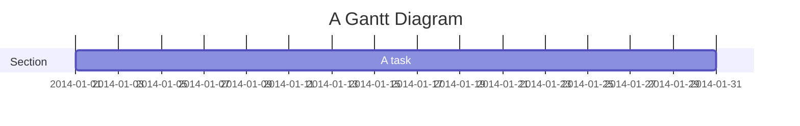

Add support for Mermaid overrides

Some Mermaid diagrams allow for YAML frontmatter. Scoobie has extended this by allowing a deep merge of the Mermaid configuration
with a special `overrides` key in the frontmatter. This could be useful for diagram-specific configuration that is not otherwise easy to set.

````markdown

````
