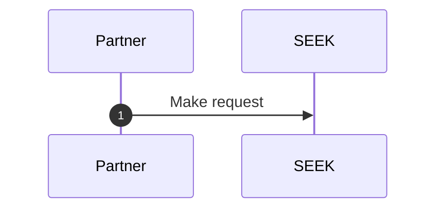

# 🧶 Scoobie

[](https://github.com/seek-oss/scoobie/actions?query=workflow%3ARelease)
[](https://github.com/seek-oss/scoobie/actions?query=workflow%3AValidate)
[](https://www.npmjs.com/package/scoobie)

Component library for SEEK documentation sites.

- Author content in [Markdown] files
- Diagram with [mermaid] code blocks
- Render content with [Braid] styling
- Integrate with [sku]

We use this to build [developer.seek.com](https://developer.seek.com), among other things.

[braid]: https://github.com/seek-oss/braid-design-system
[markdown]: https://en.wikipedia.org/wiki/Markdown
[mermaid]: https://mermaid-js.github.io/mermaid/#/n00b-overview
[react]: https://reactjs.org/
[sku]: https://github.com/seek-oss/sku

```shell
yarn add --exact scoobie
```

## Table of contents

- [Setup](#setup)
- [Markdown reference](#markdown-reference)
  - [Getting started](#getting-started)
  - [Diagrams](#diagrams)
  - [Headings](#headings)
  - [Images](#images)
  - [Links](#links)
  - [Tables](#tables)
- [React API reference](#react-api-reference)
  - [Blockquote](#blockquote)
  - [CodeBlock](#codeblock)
  - [CopyableText](#copyabletext)
  - [InlineCode](#inlinecode)
  - [InternalLink](#internallink)
  - [MdxProvider](#mdxprovider)
  - [ScoobieLink](#scoobielink)
  - [SmartTextLink](#smarttextlink)
  - [Table](#table)
  - [TableRow](#tablerow)
  - [TocRenderer](#tocrenderer)
  - [WrapperRenderer](#wrapperrenderer)
- [Styling reference](#styling-reference)
  - [code](#code)
  - [img](#img)
- [Webpack reference](#webpack-reference)
  - [ScoobieWebpackPlugin](#scoobiewebpackplugin)
  - [dangerouslySetWebpackConfig](#dangerouslysetwebpackconfig)
  - [merge](#merge)
- [Contributing](https://github.com/seek-oss/scoobie/blob/master/CONTRIBUTING.md)

## Setup

### `sku.config.js`

Compile Scoobie and bundle your Markdown content with its [Webpack plugin]:

[webpack plugin]: https://webpack.js.org/plugins/

```javascript
const { dangerouslySetWebpackConfig } = require('scoobie/webpack');

module.exports = {
  // ...

  compilePackages: ['scoobie'],
  dangerouslySetWebpackConfig,
};
```

For detailed usage, see the [Webpack reference](#webpack-reference).

### `src/render.tsx`

Fetch our favourite fonts from our Google overlords, Roboto and Roboto Mono:

```typescript
import { robotoHtml, robotoMonoHtml } from 'scoobie/typography';

const skuRender: Render<RenderContext> = {
  renderDocument: ({ app, bodyTags, headTags }) => `
    <!DOCTYPE html>
    <html>
      <head>
        <!-- ... -->
        ${robotoHtml}
        ${robotoMonoHtml}
        <!-- ... -->
  `,
};
```

If you manually manage the [Content Security Policy] of your site,
you can specify the following sources along with the script hashes from [typography.ts](typography.ts):

```http
Content-Security-Policy: font-src https://fonts.gstatic.com; script-src 'sha256-...' 'sha256-...'; style-src https://fonts.googleapis.com
```

[content security policy]: https://developer.mozilla.org/en-US/docs/Web/HTTP/CSP

### `src/scoobie.d.ts`

Import TypeScript definitions for `MDX`, `*.md` and `*.mdx`:

```ts
import 'scoobie/types';
```

## Markdown reference

### Getting started

Scoobie’s Markdown support is powered by [MDX] and custom [Remark plugins].

[mdx]: https://mdxjs.com/
[remark plugins]: https://github.com/remarkjs/remark/blob/master/doc/plugins.md

Create your content in `.md` or `.mdx` files:

```markdown
# A normal Markdown heading

Some text...

import { Alert, Text } from 'braid-design-system';

<Alert tone="critical"><Text>And a React component!</Text></Alert>
```

Import your content into a typical `.tsx` file:

```tsx
import React from 'react';

import Content from './Content.mdx';

export const ContentWithPointlessDiv = () => (
  <div>
    <Content />
  </div>
);
```

Nest your Markdown components within an [MdxProvider](#mdxprovider):

```tsx
import 'braid-design-system/reset';

import { BraidProvider } from 'braid-design-system';
import apacTheme from 'braid-design-system/themes/apac';
import React from 'react';
import { MdxProvider, ScoobieLink } from 'scoobie';

import { ContentWithPointlessDiv } from './SomeFile.tsx';

export const App = () => (
  <BraidProvider linkComponent={ScoobieLink} theme={apacTheme}>
    <MdxProvider>
      <ContentWithPointlessDiv />
    </MdxProvider>
  </BraidProvider>
);
```

(See [React context] to learn more about this pattern.)

[react context]: https://reactjs.org/docs/context.html#contextprovider

### Diagrams

Scoobie optionally supports simple, source-controlled diagrams via [mermaid].

This requires the `mermaid` configuration option to be set on [ScoobieWebpackPlugin](#scoobiewebpackplugin),
and `@mermaid-js/mermaid-cli` to be installed as a peer dependency.
From there, the easiest way to get started is to check out the [mermaid live editor].

You can use a named code block in Markdown files:

````markdown

````

Or import an `.mmd` file like so:

```markdown

```

If you use a separate `diagram.mmd` file, you can provide [additional mermaid configuration] with a `diagram.mmd.json` file in the same directory.

[mermaid live editor]: https://mermaidjs.github.io/mermaid-live-editor
[additional mermaid configuration]: https://mermaid-js.github.io/mermaid/#/mermaidAPI?id=configuration

### Headings

Anchor slugs are automatically generated for h1–h6:

```markdown
# My Little Heading1

<!-- #my-little-heading1 -->
```

### Images

Vanilla Markdown image syntax is supported:

```markdown


```

Define width and height px constraints by overloading the title:

```markdown

```

### Links

Use a root-relative path to navigate to a route managed by your React app.
This will be rendered as a React Router link and won't require a full page refresh.

Make sure to point to the route rather than the source file location:

```markdown
[👍 like this](/root/relative)

[👎 not this](/src/root/Relative.mdx)
```

Use a full URL to denote an external link.
This will open in a new tab.

```markdown
[Schema reference](https://developer.seek.com/schema)
```

### Tables

Standard Markdown table syntax is supported:

```markdown
| Default | Left | Centre | Right |
| ------- | :--- | :----: | ----: |
| x       | x    |   x    |     x |
```

Use raw HTML to render multiple lines and lists in table cells.

Care must be taken with `<p>`s; they are mapped to Braid `Text`s, which have strict semantics.
Paragraph tags must be placed around text content and cannot be nested within each other.

```markdown
| Description             | Example                                                            |
| :---------------------- | :----------------------------------------------------------------- |
| Single-line             | Line                                                               |
| Multi-line              | <p>Line 1</p><p>Line 2</p>                                         |
| Bullets                 | <ul><li><p>Bullet 1</p></li></ul>                                  |
| Multi-line with bullets | <p>Line before</p><ul><li><p>Bullet</p></li></ul><p>Line after</p> |
```

## React API reference

### Blockquote

Renders rich quoted content.

```tsx
import { List, Text } from 'braid-design-system';
import React from 'react';
import { Blockquote } from 'scoobie';

export const MyFirstBlockquote = () => (
  <Blockquote>
    <Text>This is a paragraph.</Text>

    <List>
      <Text>This is a bullet point.</Text>
    </List>
  </Blockquote>
);
```

### CodeBlock

Render lines of code with [Prism] syntax highlighting.

[prism]: https://github.com/PrismJS/prism

```tsx
import React from 'react';
import { CodeBlock } from 'scoobie';

export const MyFirstCodeBlock = () => (
  <CodeBlock language="javascript">console.log('hello, world');</CodeBlock>
);
```

### CopyableText

Render a [Text] component that copies the `children` string to clipboard on click.

```tsx
import React from 'react';
import { CodeBlock } from 'scoobie';

export const MyFirstCopyableText = () => (
  <CopyableText>This gets copied to clipboard.</CopyableText>
);
```

### InlineCode

Render code inline with text.

```tsx
import { Text } from 'braid-design-system';
import React from 'react';
import { InlineCode } from 'scoobie';

export const MyFirstInlineCode = () => (
  <Text>
    Some text with <InlineCode>InlineCode</InlineCode>!
  </Text>
);
```

### InternalLink

Render an internal link with the same opinions as our [MdxProvider](#mdxprovider):

- Internal links use client-side navigation with smooth scrolling via [react-router-hash-link],
  and pass through the `v` URL parameter for UI version switching

Unlike [SmartTextLink](#smarttextlink), this is not bound to a parent [Text] as it has no underlying [TextLink].
It can be used to make complex components navigable rather than just sections of text.

[text]: https://seek-oss.github.io/braid-design-system/components/Text/
[textlink]: https://seek-oss.github.io/braid-design-system/components/TextLink/

```tsx
import { Stack, Text } from 'braid-design-system';
import React from 'react';
import { InternalLink } from 'scoobie';

export const SomeComplexLinkElement = () => (
  <InternalLink href="/page#id" reset>
    <Stack space="medium">
      <Text>InternalLink supports complex children.</Text>

      <Text size="small">It is not bound to a parent Text component.</Text>
    </Stack>
  </InternalLink>
);
```

### MdxProvider

Provide a base collection of [Braid]-styled renderers for child MDX documents.

This should be paired with [ScoobieLink](#scoobielink) for proper internal link rendering.

```tsx
import { BraidProvider, Card } from 'braid-design-system';
import apacTheme from 'braid-design-system/themes/apac';
import React from 'react';
import { MdxProvider, ScoobieLink } from 'scoobie';

import Content from './Content.mdx';

export const Component = () => (
  <BraidProvider linkComponent={ScoobieLink} theme={apacTheme}>
    <MdxProvider>
      <Card>
        <Content />
      </Card>
    </MdxProvider>
  </BraidProvider>
);
```

### ScoobieLink

Render all underlying links as follows:

- Internal links use client-side navigation with smooth scrolling via [react-router-hash-link],
  and pass through the `v` URL parameter for UI version switching
- External links open in a new tab
- Links with a [`download` attribute] prompt the user with a file download

[`download` attribute]: https://developer.mozilla.org/en-US/docs/Web/HTML/Element/a#attr-download

This should be supplied to [BraidProvider] as the custom `linkComponent`:

```tsx
import { BraidProvider, TextLink } from 'braid-design-system';
import apacTheme from 'braid-design-system/themes/apac';
import React from 'react';
import { ScoobieLink } from 'scoobie';

export const Component = () => (
  <BraidProvider linkComponent={ScoobieLink} theme={apacTheme}>
    <TextLink href="/root-relative">Internal link</TextLink>
  </BraidProvider>
);
```

[braidprovider]: https://seek-oss.github.io/braid-design-system/components/BraidProvider

### SmartTextLink

Render a text link with the same opinions as our [MdxProvider](#mdxprovider):

- External links open in a new tab and have an [IconNewWindow] suffix

[react-router-hash-link]: https://github.com/rafrex/react-router-hash-link
[iconnewwindow]: https://seek-oss.github.io/braid-design-system/components/IconNewWindow

```tsx
import { Stack, Text } from 'braid-design-system';
import React from 'react';
import { SmartTextLink } from 'scoobie';

export const SomeLinks = () => (
  <Text>
    <Stack space="medium">
      <SmartTextLink href="/page#id">Scrolls smoothly</SmartTextLink>

      <SmartTextLink href="https://developer.seek.com/schema">
        Opens in new tab
      </SmartTextLink>
    </Stack>
  </Text>
);
```

### Table

Render an HTML table with the same styling as our [MdxProvider](#mdxprovider):

```tsx
import React, { Fragment } from 'react';
import { Table, TableRow } from 'scoobie';

export const MyFirstTable = () => (
  <Table header={['Column A', 'Column B']}>
    <TableRow>
      <Fragment>This is body cell A1.</Fragment>
      <Fragment>B1</Fragment>
    </TableRow>

    <TableRow>
      <Fragment>A2</Fragment>
      <Fragment>This is body cell B2.</Fragment>
    </TableRow>
  </Table>
);
```

### TableRow

`<tr>` component for use with [Table](#table).

Row children are flattened then wrapped with `<td>`s.

### TocRenderer

Render headings from an MDX document with a custom function.

```tsx
import { Stack, TextLink } from 'braid-design-system';
import React from 'react';
import { TocRenderer } from 'scoobie';

import Content from './Content.mdx';

export const PageWithToc = () => (
  <Stack space="medium">
    <TocRenderer document={Content}>
      {(toc) => (
        <Text>
          <Stack space="small">
            {toc.map((item) => (
              <TextLink href={`#${item.id}`} key={item.id}>
                {'|'.repeat(item.level)} {item.children}
              </TextLink>
            ))}
          </Stack>
        </Text>
      )}
    </TocRenderer>

    <Content />
  </Stack>
);
```

A heading must start at the beginning of its line to be parsed:

```markdown
# Good

- ## Bad

  - ### Super bad

## Good again
```

(This can be enforced with [markdownlint]’s [MD023] rule.)

[markdownlint]: https://github.com/markdownlint/markdownlint
[md023]: https://github.com/markdownlint/markdownlint/blob/master/docs/RULES.md#md023---headers-must-start-at-the-beginning-of-the-line

### WrapperRenderer

Render an MDX document with a [customised wrapper].

[customised wrapper]: https://mdxjs.com/guides/wrapper-customization

This allows you to derive arbitrary components from select parts of the document.

```tsx
import { Text } from 'braid-design-system';
import React, { Children } from 'react';
import { WrapperRenderer } from 'scoobie';

export const NodeCount = (Document: MDX.Document) => (
  <WrapperRenderer document={Document}>
    {({ children }) => (
      <Text>{Children.toArray(children).length} top-level node(s)</Text>
    )}
  </WrapperRenderer>
);
```

## Styling reference

Scoobie distributes some vanilla-extract styles via `scoobie/styles` submodules.

### code

Render text with the same monospace styling as our [CodeBlock](#codeblock):

```tsx
import { Box } from 'braid-design-system';
import React from 'react';
import { code } from 'scoobie/styles/code.css';

export const MyBox = () => (
  <Box className={code.standard}>
    <Box component="pre">Hello</Box>
  </Box>
);
```

### img

Render an image with the same styling as our [MdxProvider](#mdxprovider):

```tsx
import React from 'react';
import { img } from 'scoobie/styles/img.css';

export const MySvg = () => (
  <svg className={img}>
    <path />
  </svg>
);
```

## Webpack reference

Scoobie distributes its Webpack config via a `scoobie/webpack` submodule:

```typescript
const { ScoobieWebpackPlugin } = require('scoobie/webpack');
```

Compatibility notes:

- SVGs cannot be directly imported into JSX as components.

  Consider inlining the SVGs in your JSX instead.

### ScoobieWebpackPlugin

A bundle of MDX and image loaders that complement sku's Webpack config.

This needs to be ordered to run after SkuWebpackPlugin:

```javascript
const { ScoobieWebpackPlugin, merge } = require('scoobie/webpack');

module.exports = {
  // ...

  compilePackages: ['scoobie'],
  dangerouslySetWebpackConfig: (config) =>
    merge(config, {
      plugins: [
        new ScoobieWebpackPlugin({
          // Optional configuration option to enable mermaid support.
          // `@mermaid-js/mermaid-cli` must be installed as a peer dependency.
          // Temporary files are written to `${rootDir}/mermaid`.
          mermaid: {
            rootDir: __dirname,
          },
        }),
      ],
    }),
};
```

### dangerouslySetWebpackConfig

Zero-config option referenced in [sku.config.js](#skuconfigjs) above.

This slots in on top of sku without much fuss.
If you're wrangling other Webpack config and need something more composable,
see [ScoobieWebpackPlugin](#scoobiewebpackplugin).

### merge

Re-export of [webpack-merge] for convenience.

[webpack-merge]: https://github.com/survivejs/webpack-merge
