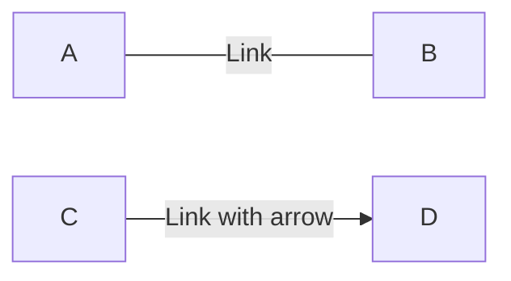
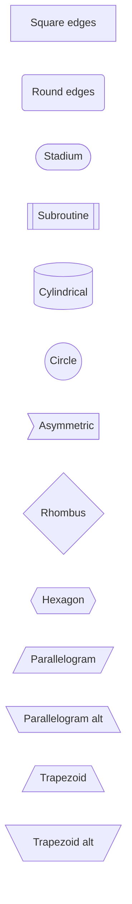
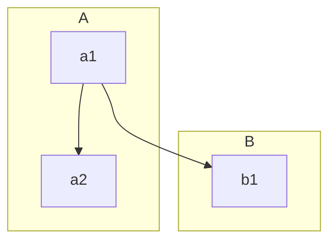
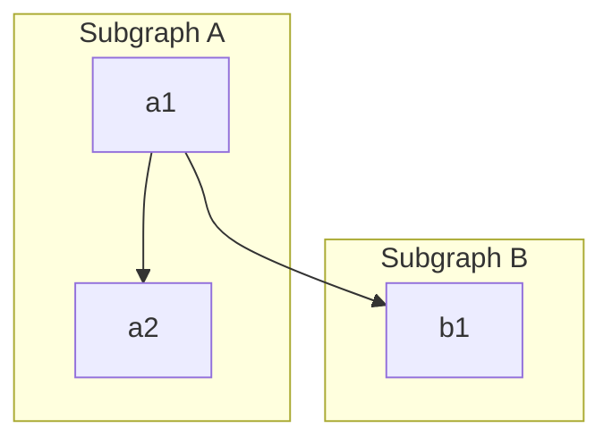

# Flowcharts

See the [official mermaid documentation](https://mermaid-js.github.io/mermaid/#/flowchart).

## Links

````markdown

````


## Shapes

````markdown
```mermaid
graph LR
    A[Square edges]
    B(Round edges)
    C[Stadium])
    D[[Subroutine]]
    E[(Cylindrical)]
    F((Circle))
    G>Asymmetric]
    H{Rhombus}
    I{{Hexagon}}
    J[/Parallelogram/]
    K[\Parallelogram alt\]
    L[/Trapezoid\]
    M[\Trapezoid alt/]
```
````



## Subgraphs

````markdown

````


