```mermaid
sequenceDiagram
    Alice->>John: Hello John, how are you?
    activate John

    loop Every minute
        John-->>Alice: Great!

        Note right of John: ♪ 𝄇
    end

    John-->>Alice: Bye!
    deactivate John
```

# Sequence diagrams

See the [official mermaid documentation](https://mermaid-js.github.io/mermaid/#/sequenceDiagram).

## Messages

````markdown

````


## Activations

````markdown

````


## Notes

````markdown

````


## Loops

````markdown

````


