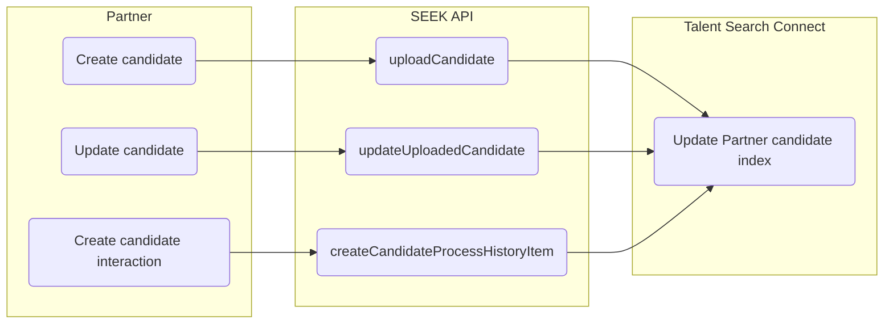

Flowchart with subgraphs:

```mermaid Sharing candidate information
graph LR
    s1-->tsc1
    s2-->tsc1
    s3-->tsc1
    p1-->s1
    p2-->s2
    p3-->s3
    subgraph Talent Search Connect
      tsc1(Update Partner candidate index)
    end
    subgraph SEEK API
      s1(uploadCandidate)
      s2(updateUploadedCandidate)
      s3(createCandidateProcessHistoryItem)
    end
    subgraph Partner
      p1(Create candidate)
      p2(Update candidate)
      p3(Create candidate interaction)
    end
```
